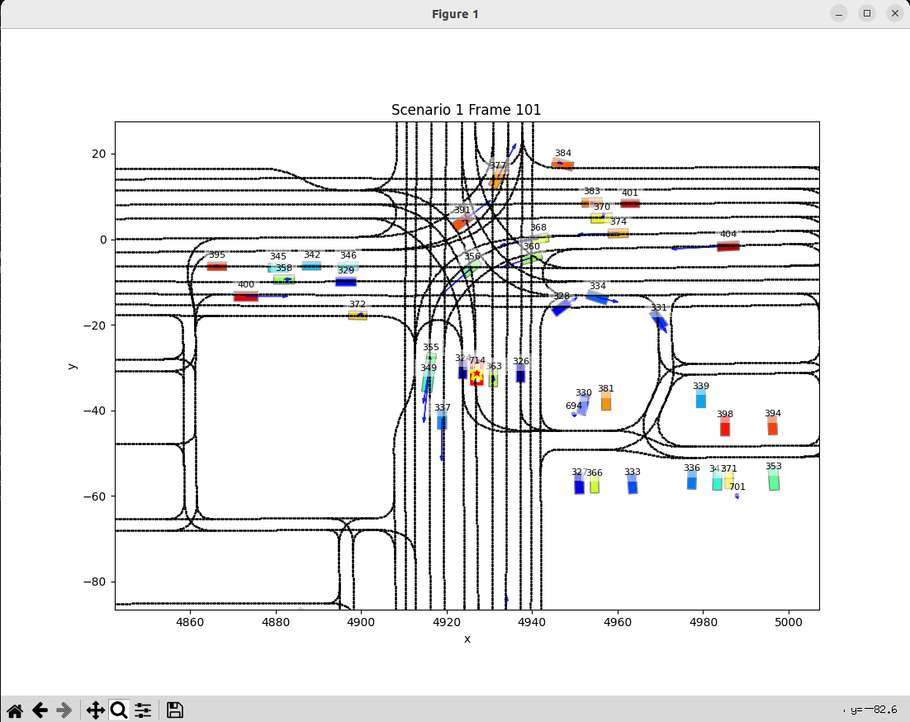
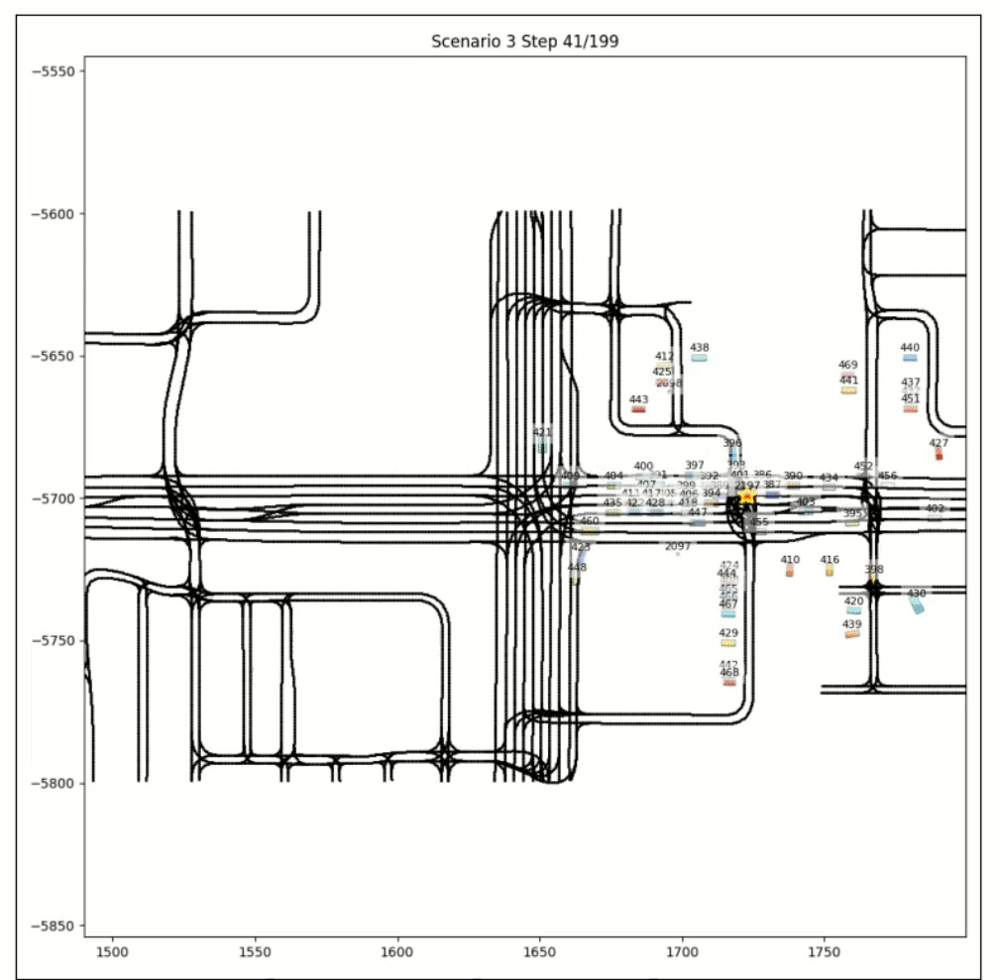

# Motion-ChauffeurNet

## Feature

1. Read data from the Waymo Open Motion Dataset
2. Visualize data from a specific frame
3. Extract trajectories for offline reinforcement learning (RL)
4. Train the ChauffeurNet model using offline trajectory data
5. Visualize a specific frame along with the model’s predicted action

## Usage

1. Install dependencies
```bash
pip install -r requirements.txt
```

2. Run the scripts

2.1 Deserialize a Waymo TFRecord file and visualize a specific frame

```bash
python dataset/motion_scenario_demo/plot_frame.py
```


2.2 Deserialize a Waymo TFRecord file and visualize an entire scenario

```bash
python dataset/motion_scenario_demo/plot_curr_state.py
```



2.3 Train and test the model using the same TFRecord file

```bash
python main.py
```

2.4 Train on most TFRecord files and test on a small held-out subset

```bash
python main_frame.py
```


2.5 Launch a GUI to select a specific frame and view the  current ACC (acceleration) decision

```bash
python gui.py
```

